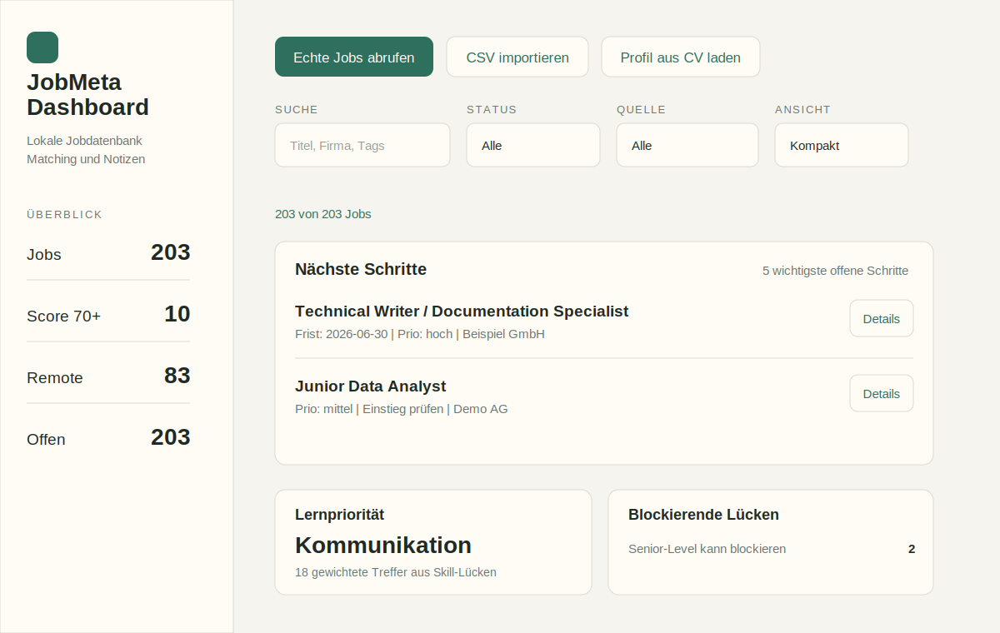
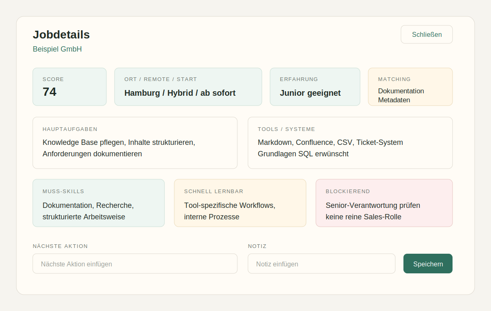
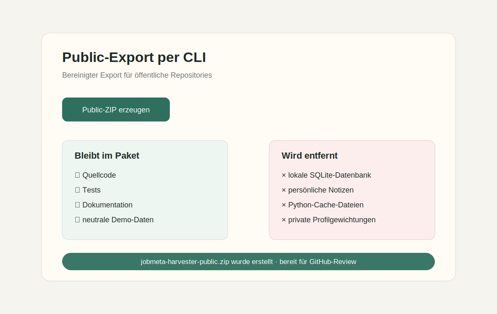
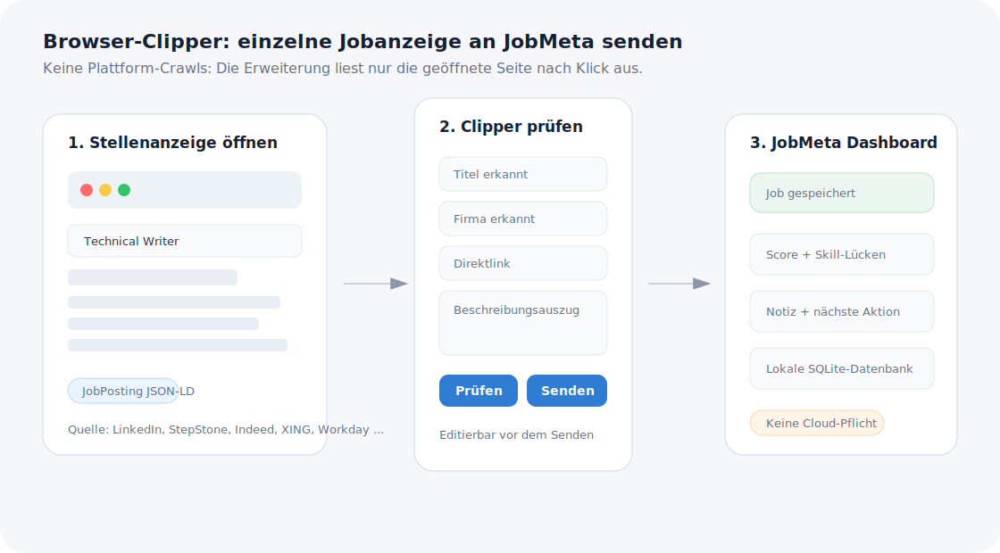

# JobMeta Harvester

**JobMeta Harvester** ist ein lokales Python-Tool zur strukturierten Jobsuche:
Stellenanzeigen werden gesammelt, normalisiert, anhand eines Profils bewertet
und in einem Browser-Dashboard für Bewerbungen nutzbar gemacht.

Das Projekt verbindet Python, SQLite, CSV-Workflows, einfache API-Adapter,
Matching-Logik und Informationsmanagement. Es ist bewusst lokal gebaut: Die
Bewerbungsdaten bleiben auf dem eigenen Rechner.



## Warum habe ich das gebaut?

Bei der Jobsuche entstehen schnell unübersichtliche Informationsmengen:
Stellenanzeigen liegen auf verschiedenen Plattformen, Anforderungen sind
unterschiedlich formuliert, Links gehen verloren und persönliche Notizen landen
in separaten Tabellen.

JobMeta Harvester behandelt Stellenanzeigen deshalb wie Metadatensätze:

- sammeln
- normalisieren
- erschließen
- bewerten
- deduplizieren
- lokal speichern
- für Entscheidungen sichtbar machen

Die Grundidee ist nicht, Bewerbungen zu automatisieren. Die Entscheidung bleibt
beim Menschen. Das Tool soll die Recherche strukturieren und sichtbar machen,
welche Stellen realistisch, interessant oder eher Lernpfade für später sind.

## Was kann das Projekt?

- Jobs aus erlaubten Quellen abrufen: Arbeitnow und Remotive
- CSV-Dateien aus manueller Recherche oder ChatGPT-gestützter Recherche importieren
- einzelne Jobseiten per optionaler Browser-Erweiterung an das Dashboard senden
- mehrere CSV-Dateien in einem Importlauf zusammenführen
- Jobs in einer lokalen SQLite-Datenbank speichern
- Dubletten anhand stabiler Job-Schlüssel erkennen
- Match-Score anhand einer editierbaren Profil-JSON berechnen
- Profil aus einem CV-Text oder PDF ableiten und vorhandene Jobs neu bewerten
- Bewerbungsstatus, Priorität, Frist, nächste Aktion und Notizen pflegen
- Skill-Lücken unterscheiden: blockierend, schnell lernbar, Bonus
- Jobs als CSV exportieren
- ein bereinigtes GitHub-/Public-Paket ohne private Daten erzeugen
- das klassische lokale Dashboard als installierbare PWA bereitstellen
- zusätzlich eine statische PWA-Live-Demo unter `/demo` bereitstellen

## Screenshots

Die folgenden Screenshots sind neutrale Mockups ohne echte Bewerbungsdaten.
Für ein öffentliches Repository sollten keine echten Stellenlisten, CV-Daten
oder privaten Notizen in Screenshots auftauchen.

### Dashboard-Übersicht


### Jobdetails und Bewerbungsnotizen



### Public-/GitHub-Export



### Browser-Clipper Workflow




## Live-Demo / PWA

Die Public-Version enthält eine installierbare PWA mit drei klaren Einstiegen:

```text
https://<dein-projekt>.vercel.app/       # Startauswahl
https://<dein-projekt>.vercel.app/demo/  # Portfolio-Demo mit verpflichtender Demo-Auswahl
https://<dein-projekt>.vercel.app/app/   # Werkzeugmodus ohne Demo-Pflicht
```

Die Demo nutzt neutrale Profile und Recherche-Snapshot-Daten. Der Werkzeugmodus speichert Daten getrennt im Browser. Für echte Bewerbungsdaten bleibt die lokale Python-/SQLite-Version die robuste private Arbeitsversion.

Mehr dazu: [Vercel Publish Steps](docs/vercel_publish_steps.md), [Lokale Vollversion](local/) und [Version 54](docs/version_54.md).

## Demo-Workflow

Der Demo-Link `/demo/` startet direkt mit einem gesperrten Demo-Datenfenster:

1. Öffentlichen Link öffnen.
2. Demo-Lebenslauf auswählen.
3. Recherche-Snapshot auswählen.
4. **Demo laden** klicken.
5. Das Dashboard wird freigegeben und zeigt Scores, Skill-Lücken, Quellen und Jobdetails.

Die Demo nutzt Recherche-Snapshots und neutrale Profile. Sie ist keine Plattform-Crawling-Demo und speichert keine privaten Daten.

Ausführlicher:

- [Demo-Guide](docs/demo_guide.md)
- [Demo-Video-/GIF-Skript](docs/demo_video_script.md)
- [Vercel Publish Steps](docs/vercel_publish_steps.md)
- [Browser-Erweiterung](docs/browser_extension.md)
- [Browser-Clipper-Workflow](docs/browser_extension_workflow.md)

## Browser-Clipper kurz erklärt

Die optionale Browser-Erweiterung übernimmt einzelne geöffnete Jobanzeigen in das lokale Dashboard. Sie ist bewusst kein Crawler: Es wird nur die aktive Seite nach einem Klick ausgelesen, die Felder bleiben vor dem Senden editierbar, und der Datensatz wird lokal an `http://127.0.0.1:8765` übertragen.

Das ist der empfohlene Workflow für große Plattformen, bei denen automatisiertes Crawling nicht vorgesehen ist: Anzeige manuell öffnen, Clipper nutzen, Datensatz prüfen, an JobMeta senden.

Siehe: [Browser-Clipper-Workflow](docs/browser_extension_workflow.md).

## Setup

### Variante A: Installiert im Projektordner

```bash
python -m pip install -e .
python -m jobmeta_harvester --dashboard
```

Danach im Browser öffnen:

```text
http://127.0.0.1:8765
```

### Variante B: Ohne Installation aus dem Repository

```bash
python -m src.jobmeta_harvester --dashboard
```

Windows-Hinweise stehen zusätzlich in [WINDOWS_START.md](WINDOWS_START.md).

## Demo-Daten laden

Eine kleine Demo-Datenbank kann lokal erzeugt werden:

```bash
python -m src.jobmeta_harvester --sample
```

Das erzeugt:

```text
data/jobs.sqlite
data/processed/jobs.csv
```

Diese Dateien sind lokale Arbeitsdaten und sollten nicht in ein öffentliches
GitHub-Repository übernommen werden.

Für eine reichhaltigere Dashboard-Demo kann zusätzlich diese CSV importiert
werden:

```text
examples/demo_jobmeta_import.csv
```

Sie enthält neutrale Beispielstellen mit Rollenclustern, Skill-Lücken,
Prioritäten und Notizen. Dadurch lassen sich Filter, Detailansicht und
Bewerbungsworkflow besser demonstrieren.

Für eine IT-nähere Demo gibt es zusätzlich:

```text
examples/demo_it_jobs.csv
```

Für den CV-Import liegt ein fiktiver Demo-Lebenslauf bereit:

```text
examples/demo_cv_it_profile.txt
```

Ein zweiter Demo-Lebenslauf mit Statistik-/Datenanalyse-Schwerpunkt liegt hier:

```text
examples/demo_cv_statistics_profile.txt
```

Damit kann im Dashboard gezeigt werden, wie aus einem Lebenslauf ein lokales
Matching-Profil erzeugt und die vorhandenen Jobs neu bewertet werden. Die beiden
Demo-CVs eignen sich gut zum Vergleich: IT-/Support-/Dokumentationsprofil vs.
Statistik-/Reporting-/Analyseprofil.

## Echte Jobs abrufen

```bash
python -m src.jobmeta_harvester --source all --limit 50
```

Nur eine Quelle:

```bash
python -m src.jobmeta_harvester --source remotive --limit 30
python -m src.jobmeta_harvester --source arbeitnow --limit 30
```

Eigene Suchbegriffe:

```bash
python -m src.jobmeta_harvester --query metadata --query documentation --limit 50
```

Hinweis: Öffentliche Job-APIs können Anfragen begrenzen oder Serverumgebungen
blockieren. Für Portfolio-Demos ist `--sample` zuverlässiger.

## CSV importieren und exportieren

Job-CSV importieren:

```bash
python -m src.jobmeta_harvester --import-jobs examples/job_import_template.csv
```

Vorhandene Datenbank als CSV exportieren:

```bash
python -m src.jobmeta_harvester --export-only
```

Die CSV-Vorlage liegt hier:

```text
examples/job_import_template.csv
```

## Profil und Matching

Die Bewertung liegt in:

```text
config/profile.json
```

Für öffentliche Beispiele gibt es:

```text
config/profile.example.json
```

Das Profil enthält positive und negative Begriffe. Positive Begriffe erhöhen
den Match-Score, negative Begriffe senken ihn.

Beispiel:

```json
{
  "positive_keywords": {
    "metadata": 10,
    "documentation": 8,
    "python": 7
  },
  "negative_keywords": {
    "senior": -12,
    "sales": -10
  }
}
```

Im Dashboard kann das Profil auch aus einem Lebenslauf aktualisiert werden.
Der CV wird lokal ausgelesen; anschließend werden vorhandene Jobs neu bewertet.

## Architektur auf einen Blick

Die App besteht aus einem lokalen Python-Server, einem Browser-Dashboard, einer
SQLite-Datenbank und mehreren Importwegen:

- erlaubte Job-APIs
- CSV-Import
- manueller Paste-Import
- CV-basierte Profilaktualisierung

Die vollständige Übersicht mit Mermaid-Diagramm steht in
[docs/architecture.md](docs/architecture.md).

## Quellen- und Workflow-Strategie

Das Projekt nutzt bewusst keine Login-Automatisierung und kein Scraping gegen
Plattformregeln. Große Jobportale können über manuell oder extern vorbereitete
CSV-Dateien in denselben Workflow gebracht werden.

Wichtig: Der automatische Live-Abruf nutzt nur erlaubte öffentliche Quellen/APIs.
Für große Plattformen sind CSV-Snapshots vorgesehen. Diese Snapshots sind
kuratierte Metadaten-Auszüge aus manueller oder KI-gestützter Webrecherche,
keine automatisierten Crawls und keine vollständigen Kopien von Stellenanzeigen.

Die mitgelieferten Recherche-Snapshots sind dokumentiert in
[docs/research_snapshots.md](docs/research_snapshots.md).

Mehr dazu:

- [Workflows und Quellenlogik](docs/workflows.md)
- [Recherche-Snapshots](docs/research_snapshots.md)
- [Quellenhinweise](docs/source_notes.md)
- [Bekannte Grenzen](docs/known_limitations.md)

## Browser-Erweiterung

Optional gibt es einen kleinen Browser-Clipper fuer Chrome/Brave/Edge und Firefox:

```text
browser_extension/jobmeta-clipper
```

Damit kann eine einzelne geöffnete Jobanzeige nach einem Klick ausgelesen, im Popup geprüft und an das lokale Dashboard gesendet werden. Das ist kein Plattform-Scraper und kein automatisiertes Crawling, sondern ein Einzelseiten-Import für den bestehenden manuellen Workflow.

Anleitung und Cross-Browser-Pakete: [docs/browser_extension.md](docs/browser_extension.md)

## Datenschutz und Public Export

Das Arbeitsprojekt kann lokale Daten enthalten:

- `data/jobs.sqlite`
- Bewerbungsnotizen
- gespeicherte Stellenlinks
- persönliche Profilgewichtungen
- eventuell CV-abgeleitete Begriffe

Für GitHub sollte deshalb nicht der komplette Arbeitsordner hochgeladen werden.
Stattdessen gibt es einen bereinigten Export:

```bash
python -m jobmeta_harvester --prepare-github-release
```

oder ohne Installation:

```bash
python -m src.jobmeta_harvester --prepare-github-release
```

Das erzeugt:

```text
dist/jobmeta-harvester-public.zip
```

Der Export entfernt SQLite-Datenbanken, Python-Caches, lokale Exporte und
ersetzt `config/profile.json` durch ein neutrales Beispielprofil. Diese Funktion
ist bewusst als Kommandozeilen-/Entwicklerfunktion dokumentiert und nicht mehr
als sichtbarer Button in der normalen Dashboard-Oberfläche platziert.

## Tests

```bash
python -m unittest discover tests
```

Der Public-Export wird ebenfalls getestet, damit keine SQLite-Datenbanken oder
Cache-Dateien versehentlich in der öffentlichen ZIP landen.

Auf GitHub läuft derselbe Check über:

```text
.github/workflows/tests.yml
```

Für eine schnelle Projektprüfung gibt es den
[Reviewer Guide](docs/reviewer_guide.md).

## Bekannte Grenzen

Das Projekt ist ein lokales Portfolio-/MVP-Projekt. Das Scoring ist
keyword-basiert, API-Ergebnisse können unvollständig sein, und das Dashboard ist
für Desktop-Nutzung optimiert. Diese Grenzen sind dokumentiert in
[docs/known_limitations.md](docs/known_limitations.md).

## Roadmap

Nächste sinnvolle Schritte wären Demo-Reife, ein kurzes GIF/Video,
transparenteres Scoring und bessere Demo-Daten. Die vollständige Roadmap steht
in [docs/roadmap.md](docs/roadmap.md).

## Projektstruktur

```text
jobmeta-harvester/
├── browser_extension/
│   └── jobmeta-clipper/
├── config/
│   ├── profile.json
│   └── profile.example.json
├── docs/
├── examples/
│   ├── job_import_template.csv
│   └── sample_jobs.json
├── src/jobmeta_harvester/
│   ├── cli.py
│   ├── dashboard.py
│   ├── database.py
│   ├── public_export.py
│   └── ...
└── tests/
```

## Was dieses Projekt zeigen soll

JobMeta Harvester ist kein Versuch, ein großes Recruiting-System zu bauen.
Es ist ein Portfolio-Projekt, das zeigt:

- strukturierte Datenverarbeitung mit Python
- lokales Speichern mit SQLite
- CSV-Import und -Export
- einfache API-Nutzung
- Datenmodellierung und Normalisierung
- Matching-/Scoring-Logik
- UI-nahe Produktüberlegungen
- Datenschutzbewusstsein
- Dokumentation eines realistischen Workflows

## Dokumentation

- [Projektstory](docs/project_story.md)
- [Demo-Guide](docs/demo_guide.md)
- [Vercel Publish Steps](docs/vercel_publish_steps.md)
- [Architektur](docs/architecture.md)
- [Workflows und Quellenlogik](docs/workflows.md)
- [Research Snapshots](docs/research_snapshots.md)
- [Bekannte Grenzen](docs/known_limitations.md)
- [Roadmap](docs/roadmap.md)
- [Datenmodell](docs/data_model.md)
- [Matching-Logik](docs/matching_logic.md)
- [Browser-Erweiterung](docs/browser_extension.md)
- [Browser-Clipper-Workflow](docs/browser_extension_workflow.md)
- [GitHub Release Checklist](docs/github_release_checklist.md)
- [Version 51](docs/version_51.md)
- [Version 52](docs/version_52.md)
- [Version 53](docs/version_53.md)
- [Version 54](docs/version_54.md)

## Version

Aktueller Public-Stand: **v56**. `/demo/` startet mit verpflichtender Demo-Auswahl und gibt die komplette Oberfläche nach dem Laden frei. `/app/` bleibt der normale Werkzeugmodus; beide Modi nutzen dieselbe Dashboard-Oberfläche, getrennten Browser-Speicher, eine Reset-Funktion für Jobdaten und eine horizontale Scrollleiste, die sich bei offenen Dialogen nicht mehr über Formularbuttons legt.


### Vercel-Deploy-Hinweis

Für Vercel erzeugt `npm run vercel-build` automatisch den statischen Ausgabeordner `public/`.

Empfohlene Vercel-Einstellungen:

- Framework Preset: Other / Static / No Framework
- Build Command: `npm run vercel-build`
- Output Directory: `public`
- Install Command: leer lassen

Die Python-/SQLite-Vollversion bleibt lokal. Vercel hostet nur die statische PWA-Demo.
