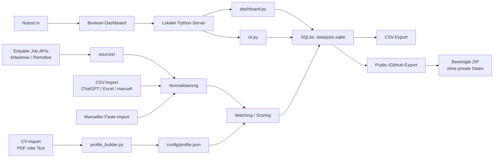

# Architektur

JobMeta Harvester ist als lokale Python-Anwendung aufgebaut. Das Dashboard
läuft als kleiner lokaler HTTP-Server und schreibt in eine SQLite-Datenbank.
Es gibt keine externe Cloud-Datenbank und keinen automatischen
Bewerbungsversand.

## Überblick



## Komponenten

| Komponente | Aufgabe |
|---|---|
| `cli.py` | Kommandozeilen-Einstieg für Abruf, Import, Export, Dashboard und Public-Export |
| `dashboard.py` | Lokales Browser-Dashboard und HTTP-Endpunkte |
| `database.py` | SQLite-Schema, Import, Update, Deduplikation und Tracking-Felder |
| `sources/` | Adapter für erlaubte Job-APIs |
| `matching/scorer.py` | Profilbasiertes Scoring von Stellenanzeigen |
| `profile_builder.py` | Ableitung eines Matching-Profils aus CV-Text |
| `public_export.py` | Bereinigte ZIP für GitHub ohne SQLite, Cache und private Daten |
| `exporters/` | CSV-Ausgabe |

## Datenfluss

1. Stellenanzeigen kommen aus erlaubten APIs, CSV-Dateien oder manuellem Import.
2. Die Daten werden in ein gemeinsames JobMeta-Format normalisiert.
3. Das Matching-Profil bewertet die Anzeige mit positiven und negativen Begriffen.
4. Neue und bekannte Anzeigen werden in SQLite gespeichert.
5. Das Dashboard liest dieselbe Datenbank und aktualisiert nur Tracking-Felder.
6. CSV-Export und Public-Export erzeugen Dateien für Bewerbungsarbeit oder GitHub.

## Lokale Datenhaltung

Die produktive Arbeitsdatenbank liegt standardmäßig hier:

```text
data/jobs.sqlite
```

Diese Datei enthält potenziell private Daten und wird nicht in den Public-Export
übernommen.

## Dashboard-Endpunkte

Das Dashboard nutzt einfache lokale JSON-Endpunkte:

| Endpoint | Methode | Zweck |
|---|---:|---|
| `/api/jobs` | GET | Jobs aus SQLite laden |
| `/api/profile` | GET/POST | Profil anzeigen oder speichern |
| `/api/profile-from-cv` | POST | CV einlesen und Profil aktualisieren |
| `/api/import-csv` | POST | JobMeta-CSV importieren |
| `/api/manual-job` | POST | manuell erfassten Job speichern |
| `/api/harvest` | POST | erlaubte Quellen abrufen |
| `/api/export-csv` | GET | Jobs als CSV herunterladen |
| `/api/public-export` | POST | bereinigtes Public-ZIP erzeugen; Entwickler-/CLI-Funktion, nicht mehr als normaler Dashboard-Button sichtbar |

## Warum diese Architektur?

Die Architektur ist bewusst einfach gehalten:

- wenig Infrastruktur
- lokal startbar
- gut testbar
- nachvollziehbare Datenflüsse
- keine versteckte Cloud-Abhängigkeit
- gute Grundlage für Portfolio-Dokumentation

Für ein Bewerbungsprojekt ist das ein Vorteil: Der Fokus liegt auf
Informationsstruktur, Datenqualität und einem realistischen Workflow statt auf
unnötiger Plattformkomplexität.
